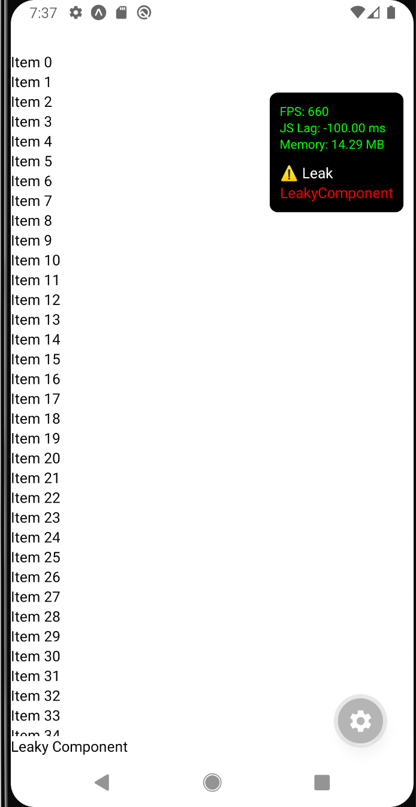

# react-native-performance-monitor

Monitor and analyze JavaScript thread performance in React Native apps with real-time usage, event loop lag, FPS tracking, and freeze detection.

## Installation

```sh
npm install react-native-performance-monitor
```

## Usage

To show JS Thread usage,lag and memory usage

```
import {PerformanceOverlay} from 'react-native-performance-monitor';

 <PerformanceOverlay />
```

to start memory leak detection

```
import {
  initPerformanceMonitor,
  useLeakDetector,
} from 'react-native-performance-monitor';

initPerformanceMonitor();
```

To register component for memory leak detection

```
// add below line to each component
  useLeakDetector('LeakyComponent');

```

and show overlay using

```
   <PerformanceOverlay />
```

Example Dev Tool Overlay


## Contributing

- [Development workflow](CONTRIBUTING.md#development-workflow)
- [Sending a pull request](CONTRIBUTING.md#sending-a-pull-request)
- [Code of conduct](CODE_OF_CONDUCT.md)

## License

MIT

---

Made with [create-react-native-library](https://github.com/callstack/react-native-builder-bob)
